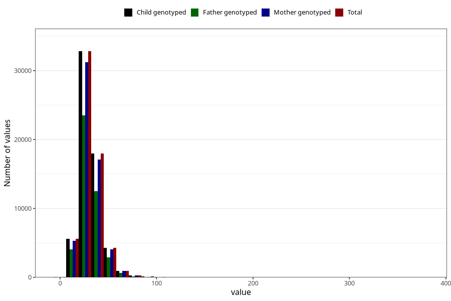

# saturated_fatty_acids
Variable mapping to `METTET` in `Skjema2_beregning_CDW_v12`.
- Number of values:

| Value | Total | Child genotyped | Mother genotyped | Father genotyped |
| ----- | ----- | --------------- | ---------------- | ---------------- |
| Missing | 13178 | 13178 | 12654 | 6217 |
| Non-missing | 62130 | 62130 | 58996 | 43867 |
| 25th percentile | 23.92 | 23.92 | 23.91 | 23.78 |
| 50th percentile | 29.44 | 29.44 | 29.42 | 29.2 |
| 75th percentile | 36.44 | 36.44 | 36.43 | 36.06 |
| Mean | 31.2860091743119 | 31.2860091743119 | 31.2637585599024 | 30.965703604076 |
| Standard deviation | 11.462957117909 | 11.462957117909 | 11.4209676773151 | 11.1589825781646 |
| N | 62130 | 62130 | 58996 | 43867 |

