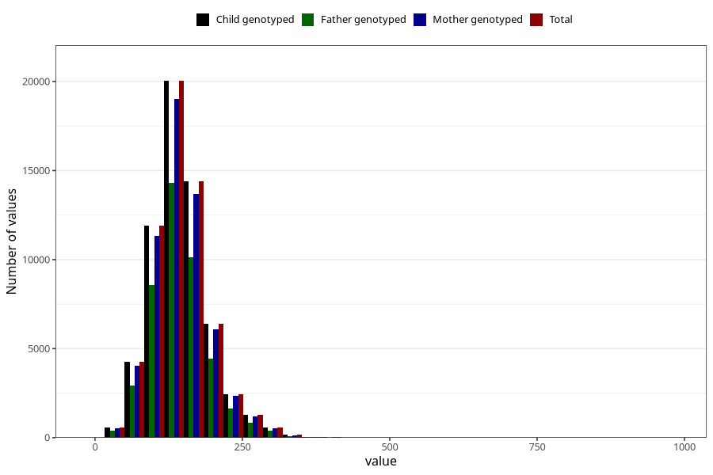

# starch
Variable mapping to `STIVELSE` in `Skjema2_beregning_CDW_v12`.
- Number of values:

| Value | Total | Child genotyped | Mother genotyped | Father genotyped |
| ----- | ----- | --------------- | ---------------- | ---------------- |
| Missing | 13178 | 13178 | 12654 | 6217 |
| Non-missing | 62130 | 62130 | 58996 | 43867 |
| 25th percentile | 114.8825 | 114.8825 | 114.83 | 114.54 |
| 50th percentile | 141.055 | 141.055 | 141.015 | 140.23 |
| 75th percentile | 170.6675 | 170.6675 | 170.63 | 169.47 |
| Mean | 145.85159375503 | 145.85159375503 | 145.813170553936 | 144.924859689516 |
| Standard deviation | 48.9743396117234 | 48.9743396117234 | 48.8191889321679 | 48.038002524044 |
| N | 62130 | 62130 | 58996 | 43867 |

