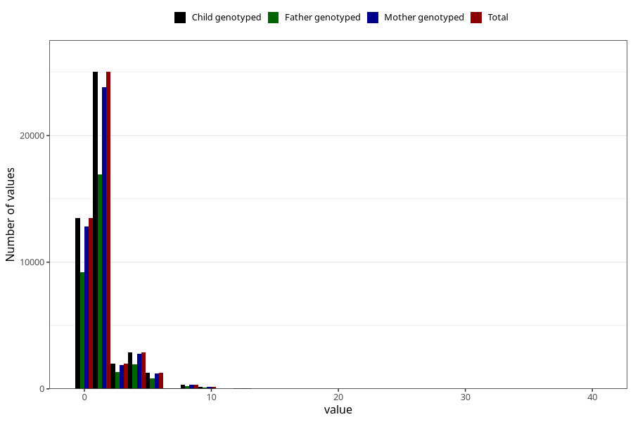

# tea_before
Variable mapping to `AA1386` in `Skjema1_v12`.
- Number of values:

| Value | Total | Child genotyped | Mother genotyped | Father genotyped |
| ----- | ----- | --------------- | ---------------- | ---------------- |
| Missing | 30070 | 30070 | 28610 | 19486 |
| Non-missing | 45238 | 45238 | 43040 | 30598 |
| Consumption have been reported by a mark but no amount given | 4 | 4 | 4 |4 |
| 0 | 13462 | 13462 | 12828 | 9196 |
| 1 | 14158 | 14158 | 13453 | 9623 |
| 2 | 10865 | 10865 | 10336 | 7321 |
| 3 | 1990 | 1990 | 1887 | 1316 |
| 4 | 2870 | 2870 | 2744 | 1930 |
| 5 | 488 | 488 | 454 | 311 |
| 6 | 785 | 785 | 745 | 503 |
| 7 | 46 | 46 | 45 | 30 |
| 8 | 353 | 353 | 335 | 222 |
| 9 | 11 | 11 | 10 | 8 |
| 10 | 137 | 137 | 132 | 87 |
| 12 | 46 | 46 | 44 | 31 |
| 14 | 6 | 6 | 6 | 5 |
| 15 | 2 | 2 | 2 | 2 |
| 16 | 5 | 5 | 5 | 3 |
| 20 | 5 | 5 | 5 | 4 |
| 24 | 3 | 3 | 3 | 1 |
| 30 | 1 | 1 | 1 | 0 |
| 40 | 1 | 1 | 1 | 1 |

