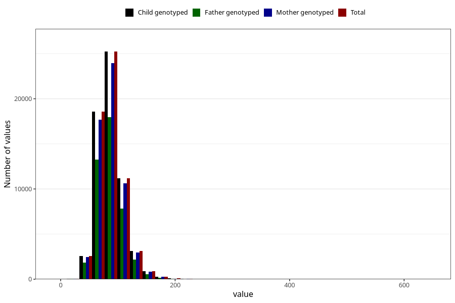

# tot_prot
Variable mapping to `TOT_PROT` in `Skjema2_beregning_CDW_v12`.
- Number of values:

| Value | Total | Child genotyped | Mother genotyped | Father genotyped |
| ----- | ----- | --------------- | ---------------- | ---------------- |
| Missing | 13178 | 13178 | 12654 | 6217 |
| Non-missing | 62130 | 62130 | 58996 | 43867 |
| 25th percentile | 72.25 | 72.25 | 72.2275 | 72.2 |
| 50th percentile | 84.62 | 84.62 | 84.59 | 84.4 |
| 75th percentile | 99.12 | 99.12 | 99.09 | 98.72 |
| Mean | 87.3998553033961 | 87.3998553033961 | 87.3566082446268 | 87.0725960289056 |
| Standard deviation | 23.3977282981434 | 23.3977282981434 | 23.3330611693508 | 22.9478465062664 |
| N | 62130 | 62130 | 58996 | 43867 |

