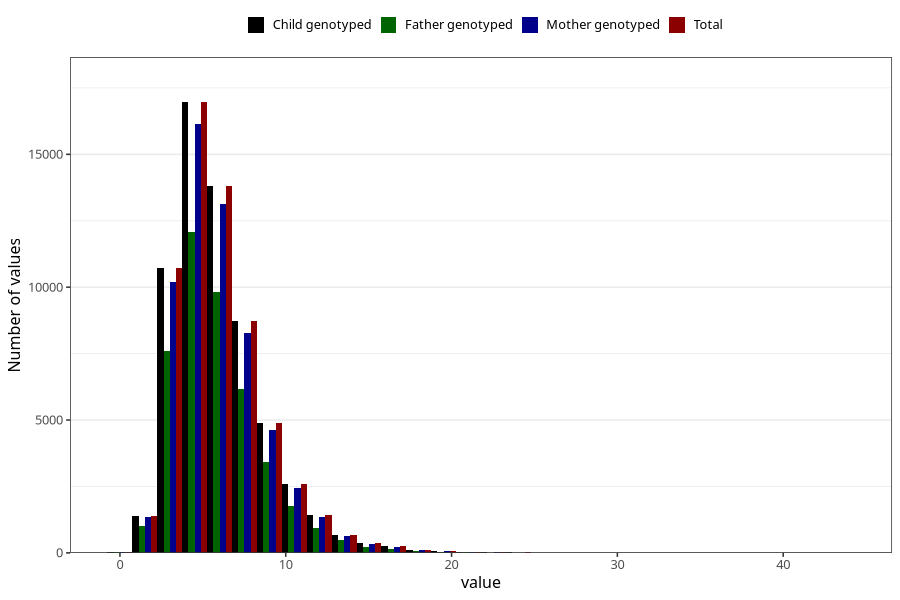

# vitamin_b12
Variable mapping to `VIT_B12` in `Skjema2_beregning_CDW_v12`.
- Number of values:

| Value | Total | Child genotyped | Mother genotyped | Father genotyped |
| ----- | ----- | --------------- | ---------------- | ---------------- |
| Missing | 13178 | 13178 | 12654 | 6217 |
| Non-missing | 62130 | 62130 | 58996 | 43867 |
| 25th percentile | 4.06 | 4.06 | 4.06 | 4.06 |
| 50th percentile | 5.43 | 5.43 | 5.43 | 5.41 |
| 75th percentile | 7.29 | 7.29 | 7.28 | 7.25 |
| Mean | 5.9871841300499 | 5.9871841300499 | 5.98224438945013 | 5.95103084323067 |
| Standard deviation | 2.78812919343617 | 2.78812919343617 | 2.77969906051524 | 2.73790107020239 |
| N | 62130 | 62130 | 58996 | 43867 |

