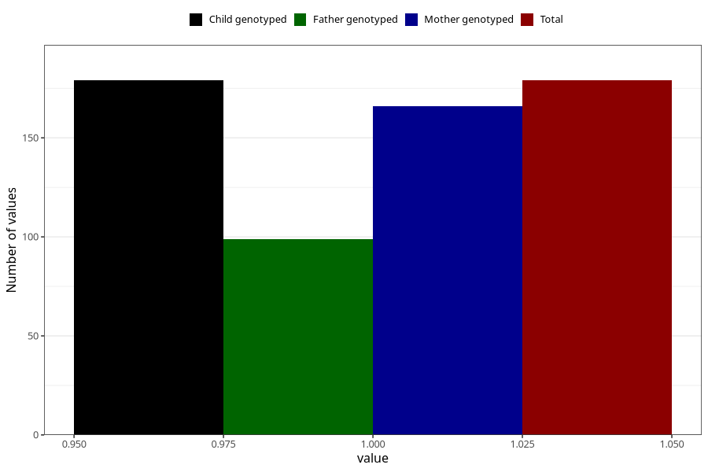

# contraception_used_diaphragm
Variable mapping to `AA29` in `Skjema1_v12`.
- Number of values:

| Value | Total | Child genotyped | Mother genotyped | Father genotyped |
| ----- | ----- | --------------- | ---------------- | ---------------- |
| Missing | 75129 | 75129 | 71484 | 49985 |
| Non-missing | 179 | 179 | 166 | 99 |
| 1 | 179 | 179 | 166 | 99 |

