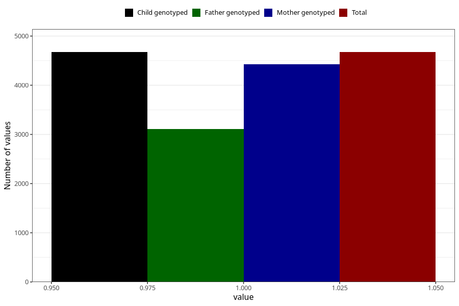

# contraception_used_mini_pill
Variable mapping to `AA33` in `Skjema1_v12`.
- Number of values:

| Value | Total | Child genotyped | Mother genotyped | Father genotyped |
| ----- | ----- | --------------- | ---------------- | ---------------- |
| Missing | 70635 | 70635 | 67223 | 46979 |
| Non-missing | 4673 | 4673 | 4427 | 3105 |
| 1 | 4673 | 4673 | 4427 | 3105 |

