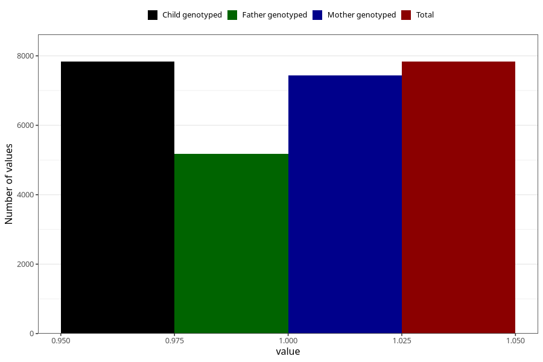

# contraception_used_safe_period
Variable mapping to `AA36` in `Skjema1_v12`.
- Number of values:

| Value | Total | Child genotyped | Mother genotyped | Father genotyped |
| ----- | ----- | --------------- | ---------------- | ---------------- |
| Missing | 67476 | 67476 | 64218 | 44903 |
| Non-missing | 7832 | 7832 | 7432 | 5181 |
| 1 | 7832 | 7832 | 7432 | 5181 |

