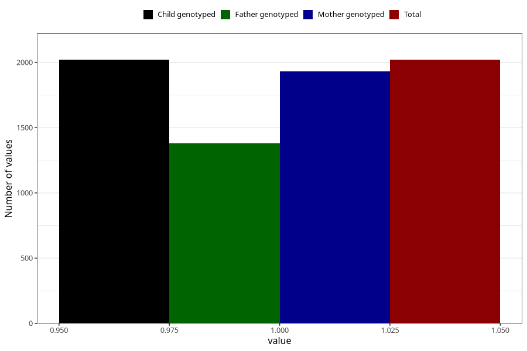

# treated_for_infertility_hormone_treatment
Variable mapping to `AA75` in `Skjema1_v12`.
- Number of values:

| Value | Total | Child genotyped | Mother genotyped | Father genotyped |
| ----- | ----- | --------------- | ---------------- | ---------------- |
| Missing | 73288 | 73288 | 69720 | 48704 |
| Non-missing | 2020 | 2020 | 1930 | 1380 |
| 1 | 2020 | 2020 | 1930 | 1380 |

