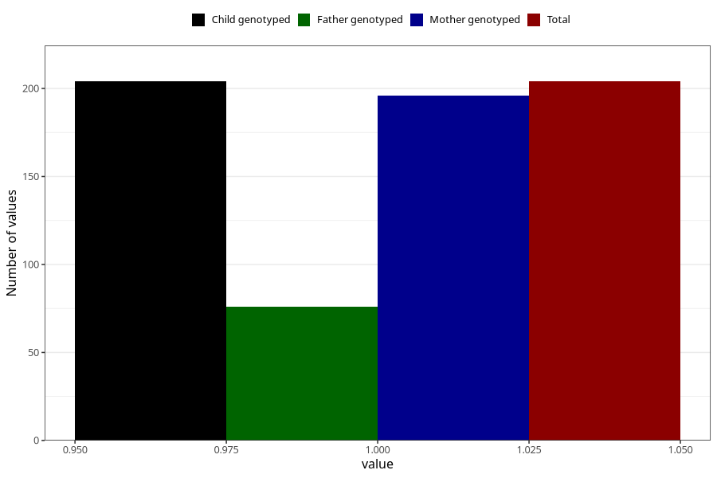

# treated_for_infertility_insemination
Variable mapping to `AA77` in `Skjema1_v12`.
- Number of values:

| Value | Total | Child genotyped | Mother genotyped | Father genotyped |
| ----- | ----- | --------------- | ---------------- | ---------------- |
| Missing | 75104 | 75104 | 71454 | 50008 |
| Non-missing | 204 | 204 | 196 | 76 |
| 1 | 204 | 204 | 196 | 76 |

