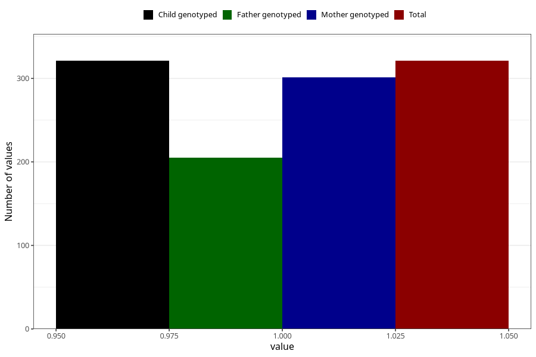

# treated_for_infertility_previous_other_surgery
Variable mapping to `AA70` in `Skjema1_v12`.
- Number of values:

| Value | Total | Child genotyped | Mother genotyped | Father genotyped |
| ----- | ----- | --------------- | ---------------- | ---------------- |
| Missing | 74987 | 74987 | 71349 | 49879 |
| Non-missing | 321 | 321 | 301 | 205 |
| 1 | 321 | 321 | 301 | 205 |

