# Phenotypes
### Number of values

### Length vs weight

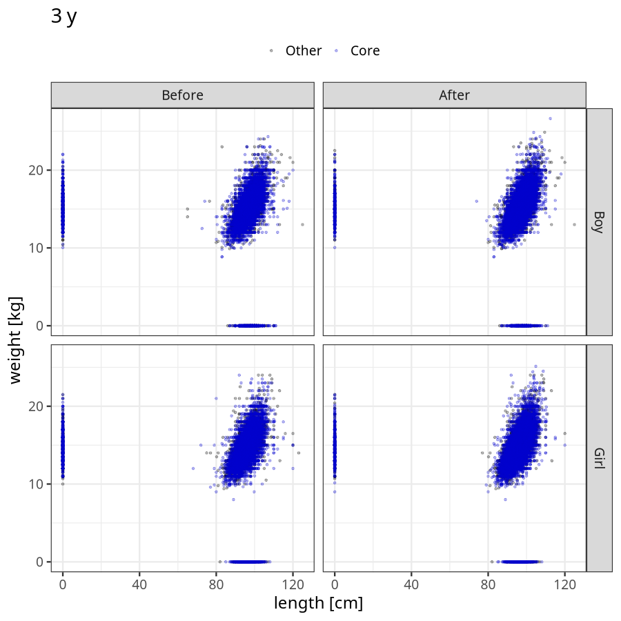

### Imputation
- Children with no data point altered: 43024
- Children with at least one data point altered: 32265
#### Random example: 31224
> outlier@length_2y imputed@length_2y
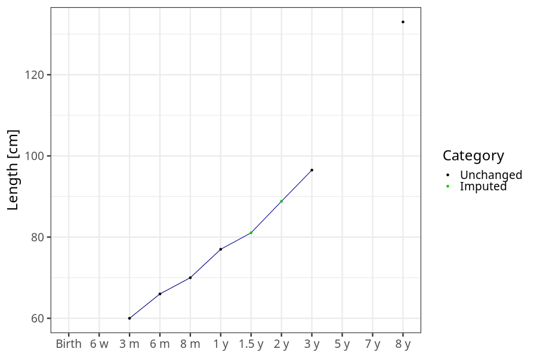

#### Random example: 42883
> outlier@length_2y imputed@length_2y

#### Random example: 61173
> outlier@length_2y imputed@length_2y

#### Random example: 21429
> outlier@length_2y imputed@length_2y

#### Random example: 12575
> outlier@length_2y imputed@length_2y

#### Random example: 1732
> outlier@length_2y imputed@length_2y

#### Random example: 29251
> outlier@length_2y imputed@length_2y

#### Random example: 5143
> outlier@length_2y imputed@length_2y

#### Random example: 28285
> outlier@length_2y imputed@length_2y
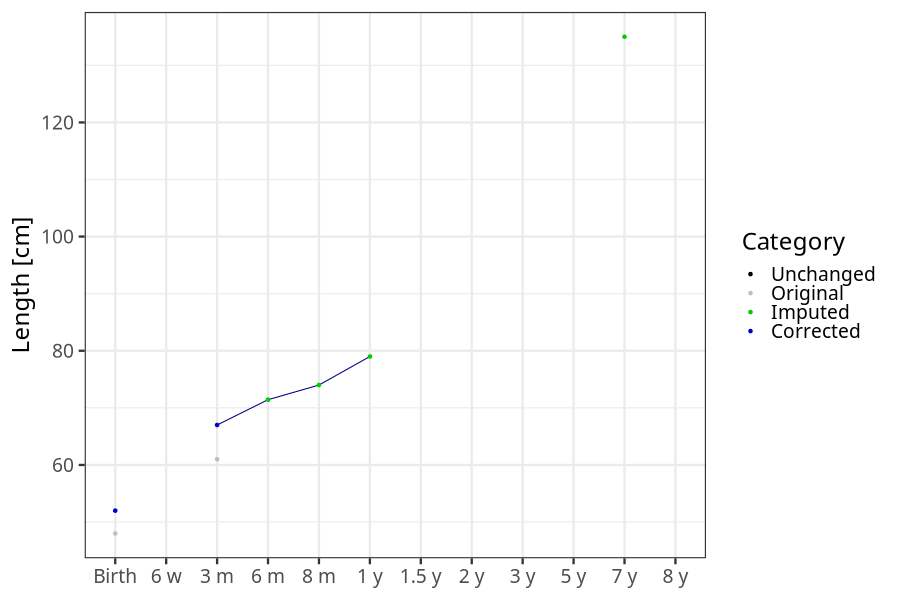

#### Random example: 26012
> outlier@length_2y imputed@length_2y

#### Random example: 26142
> outlier@length_2y imputed@length_2y

#### Random example: 73388
> outlier@length_2y imputed@length_2y
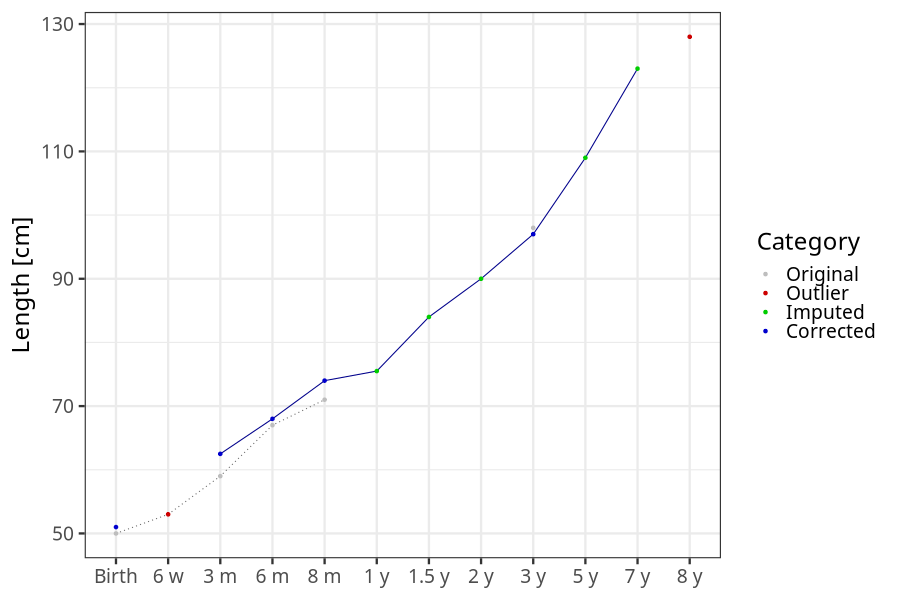

#### Random example: 44689
> outlier@length_2y imputed@length_2y

#### Random example: 60362
> outlier@length_2y imputed@length_2y
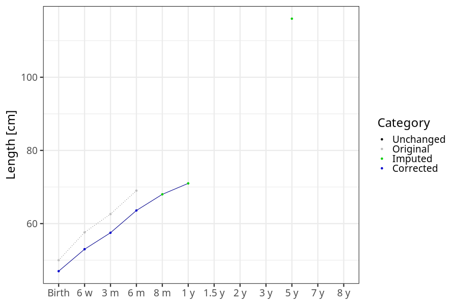
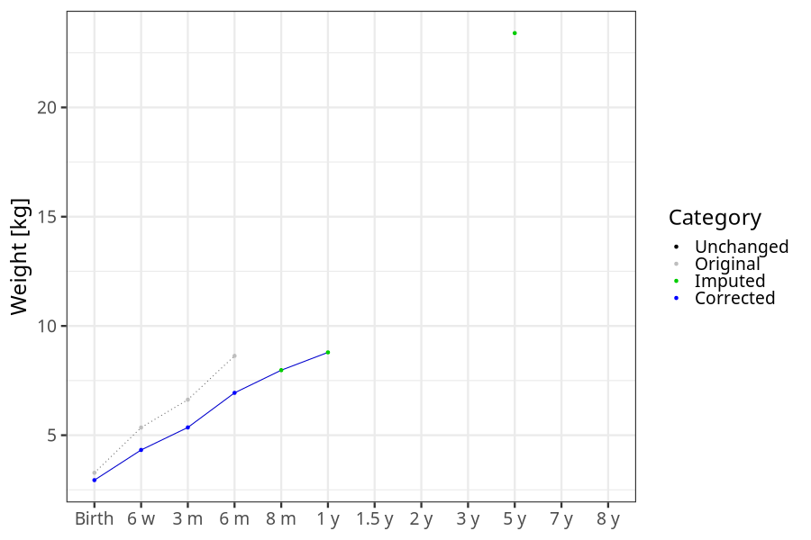
#### Random example: 61257
> outlier@length_2y imputed@length_2y

#### Random example: 46122
> outlier@length_2y imputed@length_2y

#### Random example: 18181
> outlier@length_2y imputed@length_2y

#### Random example: 67411
> outlier@length_2y imputed@length_2y

#### Random example: 37046
> outlier@length_2y imputed@length_2y

#### Random example: 24848
> outlier@length_2y imputed@length_2y

#### Most extreme example (1): 18797
> 

#### Most extreme example (2): 7146
> imputed@length_16m imputed@length_2y imputed@weight_16m imputed@weight_2y

#### Most extreme example (3): 67467
> 

#### Most extreme example (4): 2500
> imputed@length_8m imputed@length_1y imputed@length_16m imputed@weight_8m imputed@weight_1y imputed@weight_16m

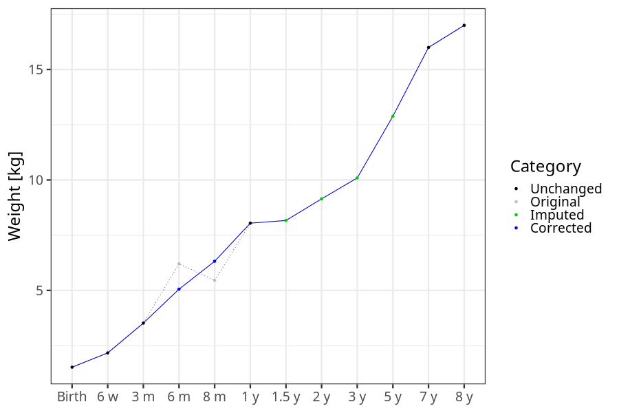
#### Most extreme example (5): 3326
> outlier@length_2y imputed@length_2y

#### Most extreme example (6): 51638
> 

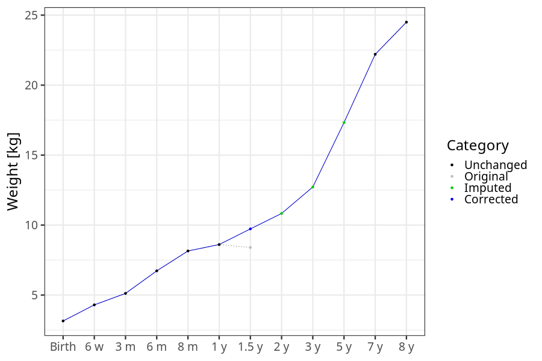
#### Most extreme example (7): 7509
> imputed@weight_6m imputed@weight_8m imputed@weight_16m

#### Most extreme example (8): 69505
> imputed@length_16m imputed@length_2y imputed@weight_16m imputed@weight_2y

#### Most extreme example (9): 9942
> outlier@weight_1y imputed@weight_1y imputed@weight_2y

#### Most extreme example (10): 66370
> 

#### Most extreme example (11): 45929
> imputed@length_16m imputed@length_2y imputed@weight_16m imputed@weight_2y

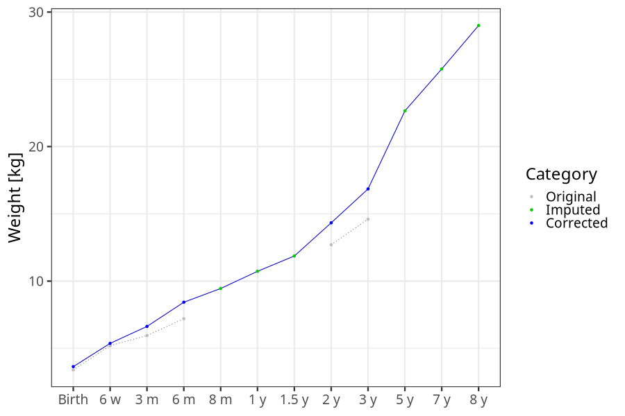
#### Most extreme example (12): 72715
> 

#### Most extreme example (13): 11446
> imputed@length_8m imputed@length_1y imputed@length_16m imputed@length_2y imputed@length_5y

#### Most extreme example (14): 66325
> imputed@length_16m imputed@weight_16m imputed@weight_5y

#### Most extreme example (15): 44840
> imputed@length_16m imputed@length_2y imputed@length_3y imputed@weight_16m imputed@weight_2y imputed@weight_3y

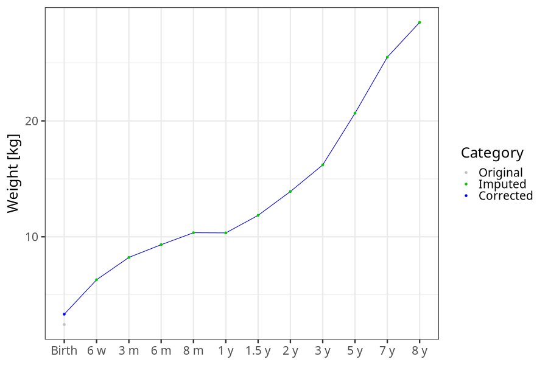
#### Most extreme example (16): 34264
> 
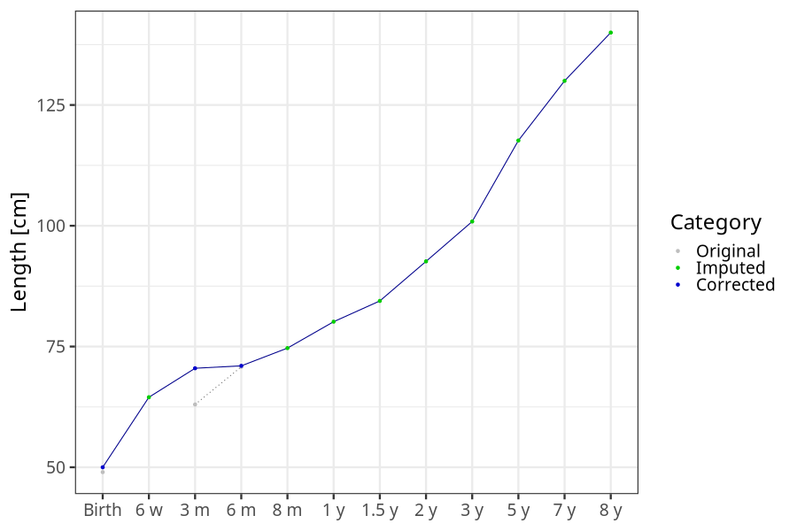

#### Most extreme example (17): 27421
> 

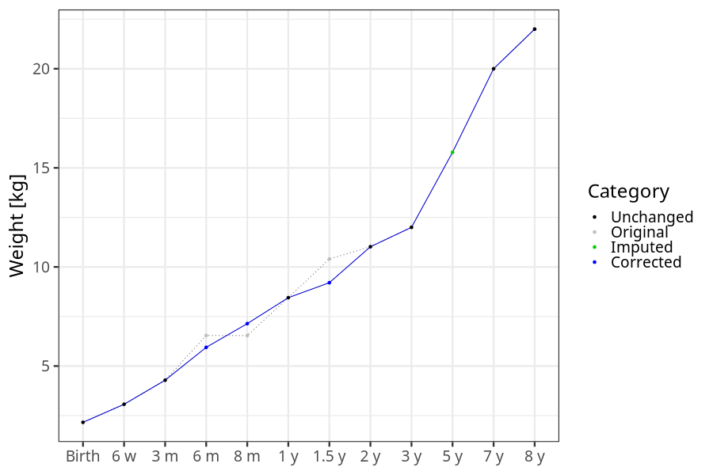
#### Most extreme example (18): 71653
> imputed@length_16m imputed@length_2y imputed@length_5y imputed@weight_16m imputed@weight_2y imputed@weight_5y outlier@weight_8y
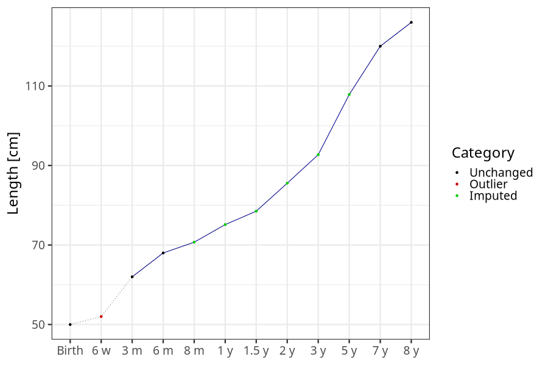

#### Most extreme example (19): 12956
> 

#### Most extreme example (20): 24505
> imputed@length_3y imputed@length_5y imputed@weight_3y imputed@weight_5y outlier@length_8y

