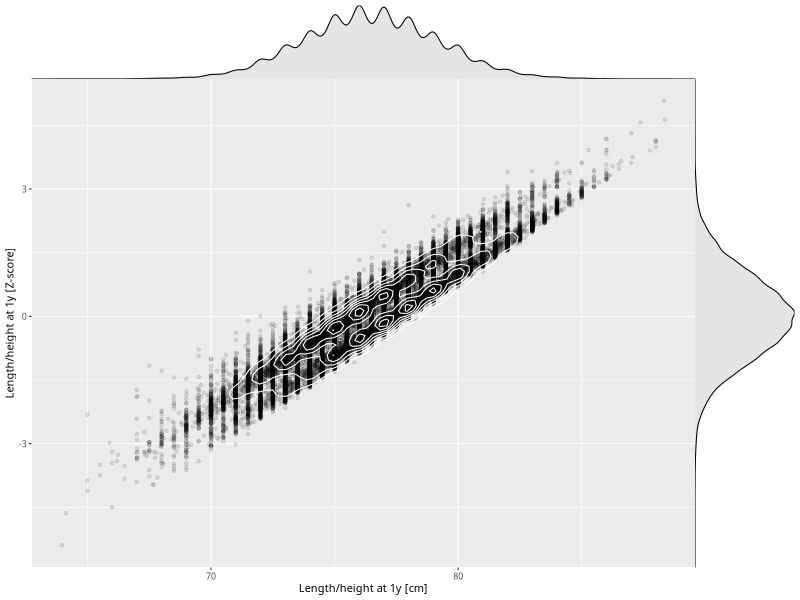

## Length/height at 1y

| Name | # Children | # Mothers | # Fathers | # Total |
| ---- | ---------- | --------- | --------- | ------- |
| length_1y | 54636 | 52020 | 37002 | 143658 |
| z_length_1y | 54636 | 52020 | 37002 | 143658 |

- Formula: `length_1y ~ fp(pregnancy_duration_1)`
- Sigma formula: ` ~ pregnancy_duration_1`
- Distribution: `NO`
- Normalization: `centiles.pred` Z-scores

