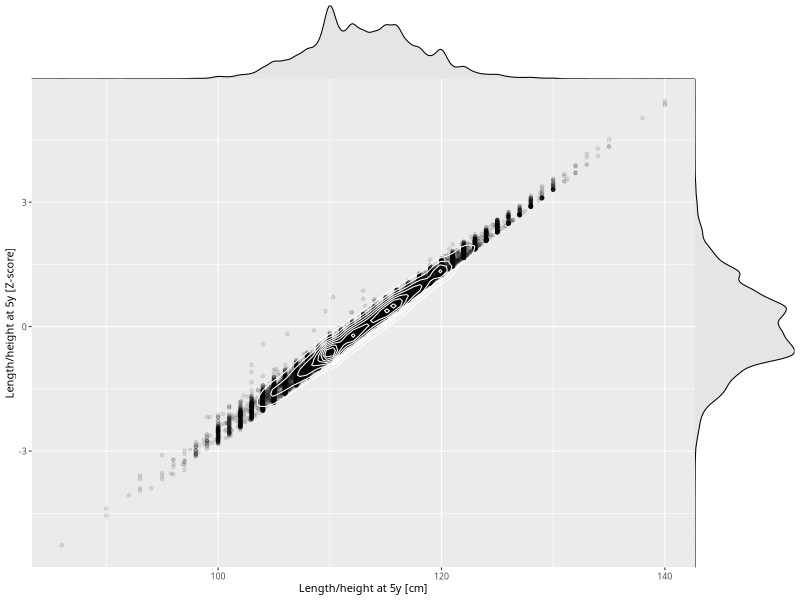

## Length/height at 5y

| Name | # Children | # Mothers | # Fathers | # Total |
| ---- | ---------- | --------- | --------- | ------- |
| length_5y | 34541 | 32759 | 24710 | 92010 |
| z_length_5y | 34541 | 32759 | 24710 | 92010 |

- Formula: `length_5y ~ fp(pregnancy_duration_1)`
- Sigma formula: ` ~ pregnancy_duration_1`
- Distribution: `NO`
- Normalization: `centiles.pred` Z-scores

