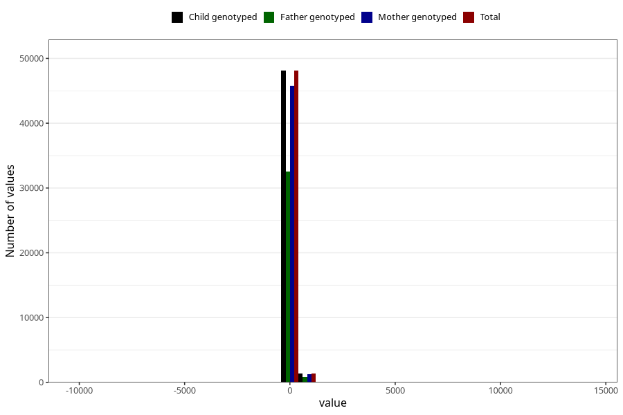

# age_1y
Variable mapping to `Q5_AGE_1_Y` in `Skjema5_18mnd_v12`.
- Number of values:

| Value | Total | Child genotyped | Mother genotyped | Father genotyped |
| ----- | ----- | --------------- | ---------------- | ---------------- |
| Missing | 25854 | 25854 | 24537 | 16655 |
| Non-missing | 49454 | 49454 | 47113 | 33429 |
| 25th percentile | 363 | 363 | 363 | 363 |
| 50th percentile | 369 | 369 | 369 | 369 |
| 75th percentile | 377 | 377 | 377 | 377 |
| Mean | 370.52745986169 | 370.52745986169 | 370.600556109779 | 370.921385623261 |
| Standard deviation | 91.2801184312219 | 91.2801184312219 | 93.1162912559477 | 86.6412328218145 |
| N | 49454 | 49454 | 47113 | 33429 |

