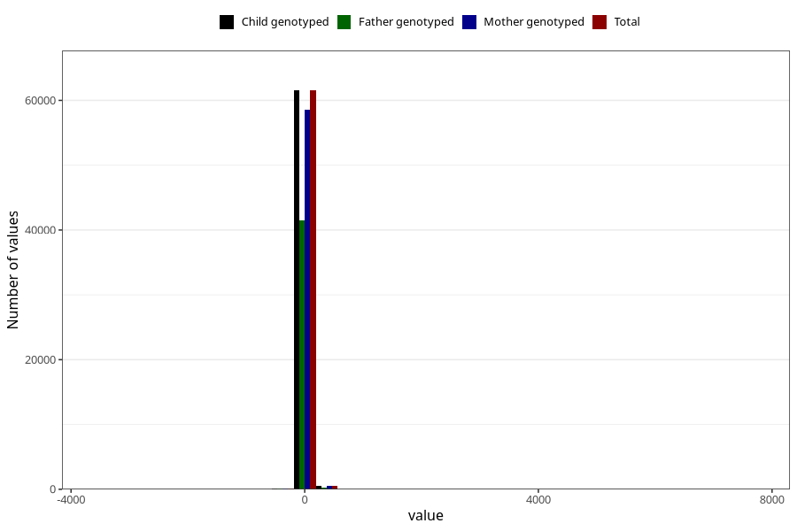

# age_3m
Variable mapping to `ALDER3MND_SJEKK` in `Skjema4_6mnd_v12`.
- Number of values:

| Value | Total | Child genotyped | Mother genotyped | Father genotyped |
| ----- | ----- | --------------- | ---------------- | ---------------- |
| Missing | 13086 | 13086 | 12395 | 8207 |
| Non-missing | 62222 | 62222 | 59255 | 41877 |
| 25th percentile | 90 | 90 | 90 | 90 |
| 50th percentile | 94 | 94 | 94 | 94 |
| 75th percentile | 99 | 99 | 99 | 98 |
| Mean | 95.9743499083925 | 95.9743499083925 | 96.0414817314994 | 95.8233636602431 |
| Standard deviation | 62.1084742844905 | 62.1084742844905 | 62.7326759562413 | 64.600577454355 |
| N | 62222 | 62222 | 59255 | 41877 |

