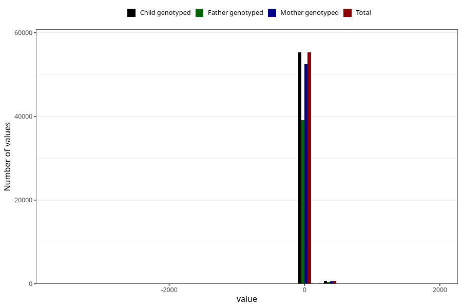

# age_6w
Variable mapping to `ALDER6UK_SJEKK` in `Skjema4_6mnd_v12`.
- Number of values:

| Value | Total | Child genotyped | Mother genotyped | Father genotyped |
| ----- | ----- | --------------- | ---------------- | ---------------- |
| Missing | 19179 | 19179 | 18341 | 10438 |
| Non-missing | 56129 | 56129 | 53309 | 39646 |
| 25th percentile | 40 | 40 | 40 | 40 |
| 50th percentile | 44 | 44 | 44 | 44 |
| 75th percentile | 48 | 48 | 48 | 48 |
| Mean | 46.7615492882467 | 46.7615492882467 | 46.8122080699319 | 46.7631286888967 |
| Standard deviation | 60.641920603546 | 60.641920603546 | 60.1700347951326 | 60.1720966002533 |
| N | 56129 | 56129 | 53309 | 39646 |

