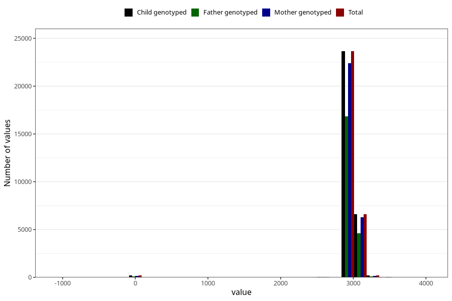

# age_8y
Variable mapping to `AGE_MTHS_Q8AAR` in `Skjema8aar_v12`.
- Number of values:

| Value | Total | Child genotyped | Mother genotyped | Father genotyped |
| ----- | ----- | --------------- | ---------------- | ---------------- |
| Missing | 44509 | 44509 | 42448 | 28321 |
| Non-missing | 30799 | 30799 | 29202 | 21763 |
| 25th percentile | 2922 | 2922 | 2922 | 2922 |
| 50th percentile | 2952.4375 | 2952.4375 | 2952.4375 | 2952.4375 |
| 75th percentile | 2982.875 | 2982.875 | 2982.875 | 2982.875 |
| Mean | 2951.59945331017 | 2951.59945331017 | 2951.43375667762 | 2952.83050360704 |
| Standard deviation | 244.150334472336 | 244.150334472336 | 245.353869238524 | 233.433636653503 |
| N | 30799 | 30799 | 29202 | 21763 |

