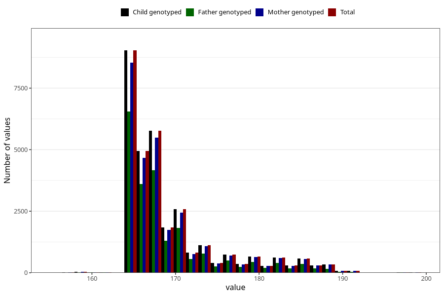

# age_answering_q_13
Variable mapping to `AGE_MTHS_KOST` in `Kosthold_ungdom_v12`.
- Number of values:

| Value | Total | Child genotyped | Mother genotyped | Father genotyped |
| ----- | ----- | --------------- | ---------------- | ---------------- |
| Missing | 44360 | 44360 | 42239 | 28277 |
| Non-missing | 30948 | 30948 | 29411 | 21807 |
| 25th percentile | 165 | 165 | 165 | 165 |
| 50th percentile | 167 | 167 | 167 | 167 |
| 75th percentile | 171 | 171 | 171 | 170 |
| Mean | 169.200562233424 | 169.200562233424 | 169.239468226174 | 168.87614068877 |
| Standard deviation | 6.083546333175 | 6.083546333175 | 6.12152357201004 | 5.71147537252445 |
| N | 30948 | 30948 | 29411 | 21807 |

