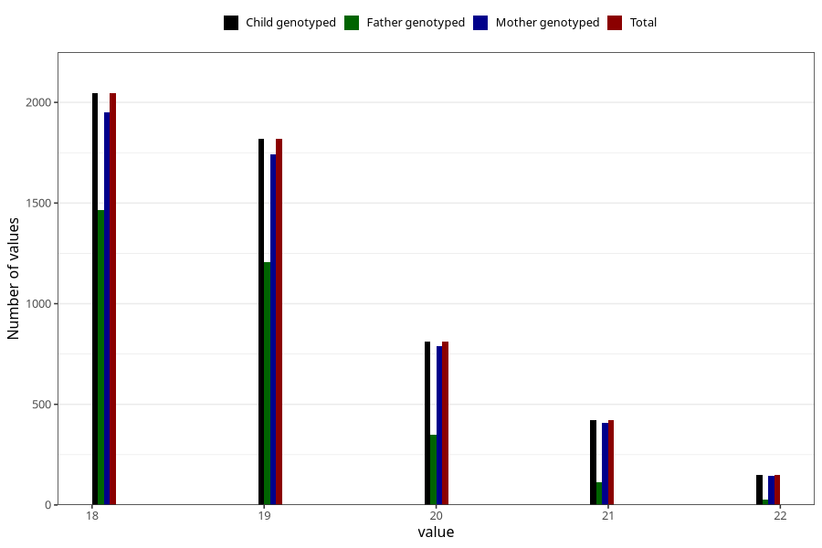

# age_answering_q_18
Variable mapping to `AGE_YRS_VE` in `18-aarsskjema_v12_standard`.
- Number of values:

| Value | Total | Child genotyped | Mother genotyped | Father genotyped |
| ----- | ----- | --------------- | ---------------- | ---------------- |
| Missing | 70067 | 70067 | 66618 | 46925 |
| Non-missing | 5241 | 5241 | 5032 | 3159 |
| 18 | 2045 | 2045 | 1949 | 1463 |
| 19 | 1818 | 1818 | 1742 | 1206 |
| 20 | 810 | 810 | 789 | 351 |
| 21 | 420 | 420 | 407 | 111 |
| 22 | 148 | 148 | 145 | 28 |

