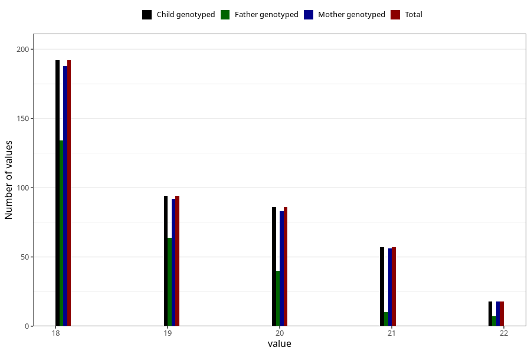

# age_answering_q_wf
Variable mapping to `AGE_YRS_WK` in `WF_Klinikkskjema_v12`.
- Number of values:

| Value | Total | Child genotyped | Mother genotyped | Father genotyped |
| ----- | ----- | --------------- | ---------------- | ---------------- |
| Missing | 74861 | 74861 | 71213 | 49829 |
| Non-missing | 447 | 447 | 437 | 255 |
| 18 | 192 | 192 | 188 | 134 |
| 19 | 94 | 94 | 92 | 64 |
| 20 | 86 | 86 | 83 | 40 |
| 21 | 57 | 57 | 56 | 10 |
| 22 | 18 | 18 | 18 | 7 |

