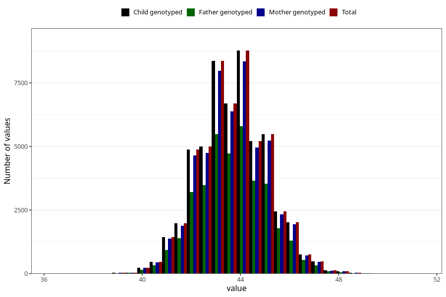

# hc_6m
Variable mapping to `DD226` in `Skjema4_6mnd_v12`.
- Number of values:

| Value | Total | Child genotyped | Mother genotyped | Father genotyped |
| ----- | ----- | --------------- | ---------------- | ---------------- |
| Missing | 20663 | 20663 | 19643 | 13160 |
| Non-missing | 54645 | 54645 | 52007 | 36924 |
| 25th percentile | 42.8 | 42.8 | 42.8 | 42.8 |
| 50th percentile | 43.7 | 43.7 | 43.7 | 43.7 |
| 75th percentile | 44.5 | 44.5 | 44.5 | 44.5 |
| Mean | 43.6730661542685 | 43.6730661542685 | 43.6741169457958 | 43.679360307659 |
| Standard deviation | 1.37475100237527 | 1.37475100237527 | 1.37558110434273 | 1.37365554976011 |
| N | 54645 | 54645 | 52007 | 36924 |

