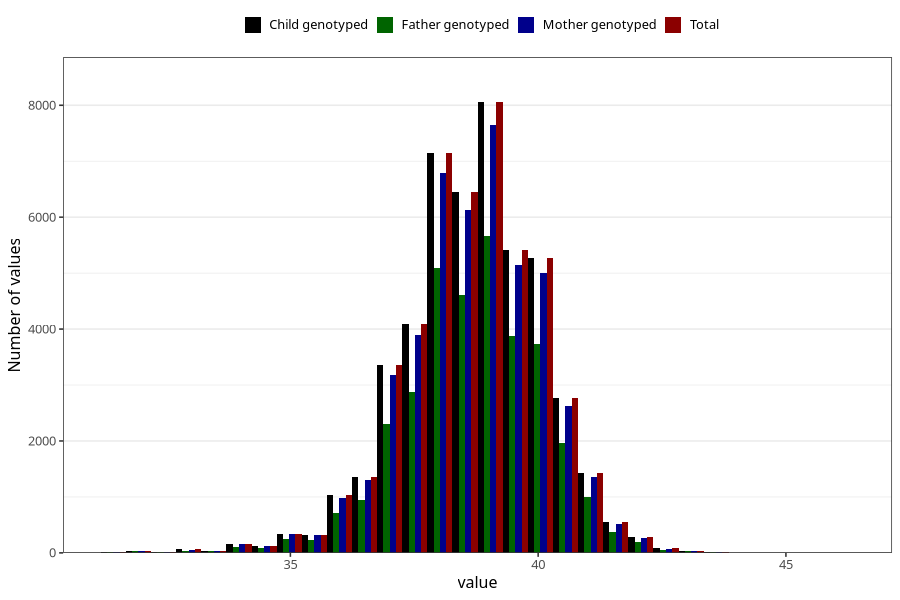

# hc_6w
Variable mapping to `DD214` in `Skjema4_6mnd_v12`.
- Number of values:

| Value | Total | Child genotyped | Mother genotyped | Father genotyped |
| ----- | ----- | --------------- | ---------------- | ---------------- |
| Missing | 26825 | 26825 | 25618 | 15866 |
| Non-missing | 48483 | 48483 | 46032 | 34218 |
| 25th percentile | 38 | 38 | 38 | 38 |
| 50th percentile | 38.7 | 38.7 | 38.7 | 38.7 |
| 75th percentile | 39.5 | 39.5 | 39.5 | 39.5 |
| Mean | 38.6537095476765 | 38.6537095476765 | 38.6515858533194 | 38.6596265123619 |
| Standard deviation | 1.38780764969787 | 1.38780764969787 | 1.3890391729863 | 1.3815926953559 |
| N | 48483 | 48483 | 46032 | 34218 |

