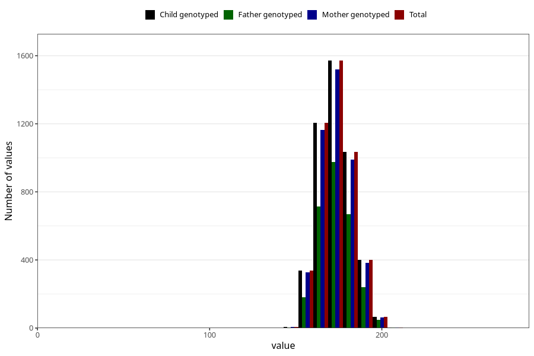

# height_19
Variable mapping to `VG134` in `19_aarsskjema_standard`.
- Number of values:

| Value | Total | Child genotyped | Mother genotyped | Father genotyped |
| ----- | ----- | --------------- | ---------------- | ---------------- |
| Missing | 70678 | 70678 | 67189 | 47246 |
| Non-missing | 4630 | 4630 | 4461 | 2838 |
| 25th percentile | 167 | 167 | 167 | 167 |
| 50th percentile | 172 | 172 | 172 | 173 |
| 75th percentile | 180 | 180 | 180 | 180 |
| Mean | 173.349892008639 | 173.349892008639 | 173.309571844878 | 173.621916842847 |
| Standard deviation | 9.92838011358577 | 9.92838011358577 | 9.94037697765521 | 10.0289907011846 |
| N | 4630 | 4630 | 4461 | 2838 |

