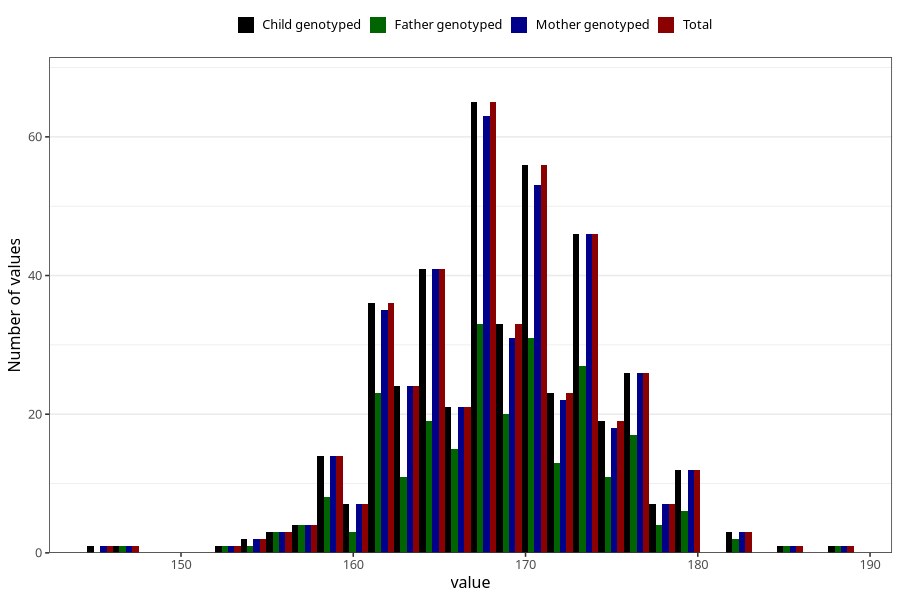

# height_wf
Variable mapping to `WK12` in `WF_Klinikkskjema_v12`.
- Number of values:

| Value | Total | Child genotyped | Mother genotyped | Father genotyped |
| ----- | ----- | --------------- | ---------------- | ---------------- |
| Missing | 74861 | 74861 | 71213 | 49829 |
| Non-missing | 447 | 447 | 437 | 255 |
| 25th percentile | 164 | 164 | 164 | 164 |
| 50th percentile | 169 | 169 | 169 | 169 |
| 75th percentile | 173 | 173 | 173 | 173 |
| Mean | 168.519015659955 | 168.519015659955 | 168.503432494279 | 168.56862745098 |
| Standard deviation | 5.91107275303582 | 5.91107275303582 | 5.95457669392242 | 6.18690165152964 |
| N | 447 | 447 | 437 | 255 |

