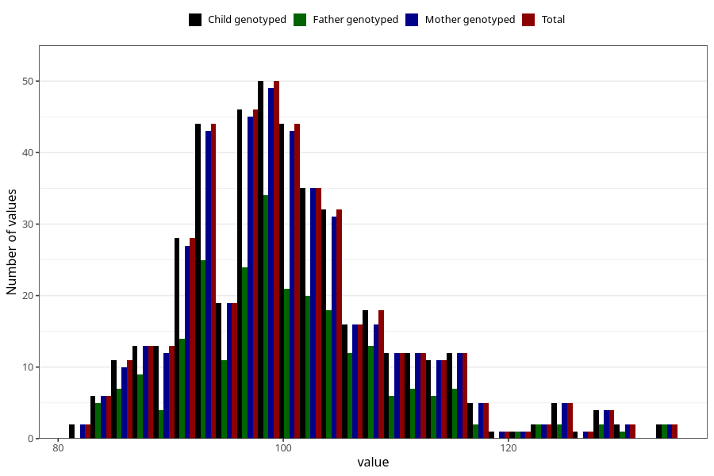

# hip_cm_wf
Variable mapping to `WK14` in `WF_Klinikkskjema_v12`.
- Number of values:

| Value | Total | Child genotyped | Mother genotyped | Father genotyped |
| ----- | ----- | --------------- | ---------------- | ---------------- |
| Missing | 74861 | 74861 | 71213 | 49829 |
| Non-missing | 447 | 447 | 437 | 255 |
| 25th percentile | 94 | 94 | 94 | 94.5 |
| 50th percentile | 99 | 99 | 99 | 99 |
| 75th percentile | 105 | 105 | 105 | 105 |
| Mean | 100.478747203579 | 100.478747203579 | 100.54233409611 | 100.623529411765 |
| Standard deviation | 9.22605349003425 | 9.22605349003425 | 9.25510853469808 | 9.25020936633231 |
| N | 447 | 447 | 437 | 255 |

