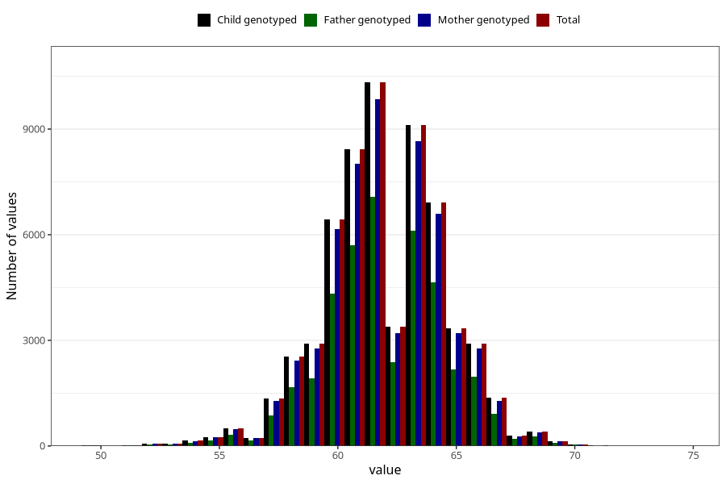

# length_3m
Variable mapping to `DD219` in `Skjema4_6mnd_v12`.
- Number of values:

| Value | Total | Child genotyped | Mother genotyped | Father genotyped |
| ----- | ----- | --------------- | ---------------- | ---------------- |
| Missing | 14080 | 14080 | 13332 | 8881 |
| Non-missing | 61228 | 61228 | 58318 | 41203 |
| 25th percentile | 60.5 | 60.5 | 60.5 | 60.5 |
| 50th percentile | 62 | 62 | 62 | 62 |
| 75th percentile | 64 | 64 | 64 | 63.7 |
| Mean | 62.02115372052 | 62.02115372052 | 62.0180493158202 | 62.024114748926 |
| Standard deviation | 2.51664698367868 | 2.51664698367868 | 2.51739215376325 | 2.49763540222218 |
| N | 61228 | 61228 | 58318 | 41203 |

