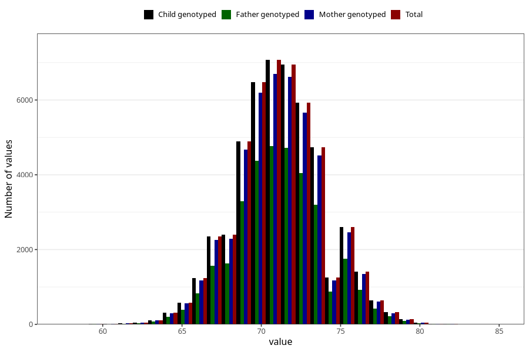

# length_8m
Variable mapping to `EE387` in `Skjema5_18mnd_v12`.
- Number of values:

| Value | Total | Child genotyped | Mother genotyped | Father genotyped |
| ----- | ----- | --------------- | ---------------- | ---------------- |
| Missing | 25712 | 25712 | 24400 | 16573 |
| Non-missing | 49596 | 49596 | 47250 | 33511 |
| 25th percentile | 69.5 | 69.5 | 69.5 | 69.5 |
| 50th percentile | 71 | 71 | 71 | 71 |
| 75th percentile | 73 | 73 | 73 | 73 |
| Mean | 71.2292543753529 | 71.2292543753529 | 71.2259343915344 | 71.2315717227179 |
| Standard deviation | 2.77400323676677 | 2.77400323676677 | 2.77327659839596 | 2.76369154599883 |
| N | 49596 | 49596 | 47250 | 33511 |

