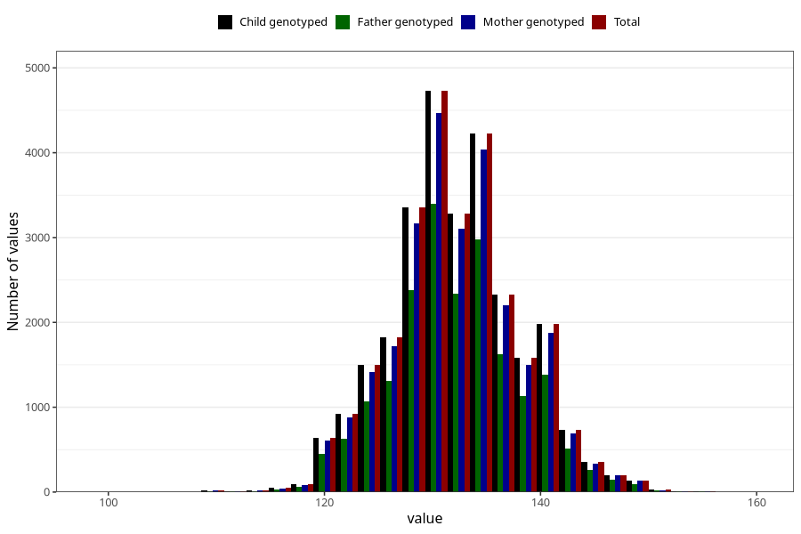

# length_8y
Variable mapping to `NN24` in `Skjema8aar_v12`.
- Number of values:

| Value | Total | Child genotyped | Mother genotyped | Father genotyped |
| ----- | ----- | --------------- | ---------------- | ---------------- |
| Missing | 47276 | 47276 | 45084 | 30226 |
| Non-missing | 28032 | 28032 | 26566 | 19858 |
| 25th percentile | 128 | 128 | 128 | 128 |
| 50th percentile | 132 | 132 | 132 | 132 |
| 75th percentile | 136 | 136 | 136 | 136 |
| Mean | 132.230343892694 | 132.230343892694 | 132.232025897764 | 132.220566018733 |
| Standard deviation | 5.76620371283605 | 5.76620371283605 | 5.76576405149753 | 5.73605681883242 |
| N | 28032 | 28032 | 26566 | 19858 |

