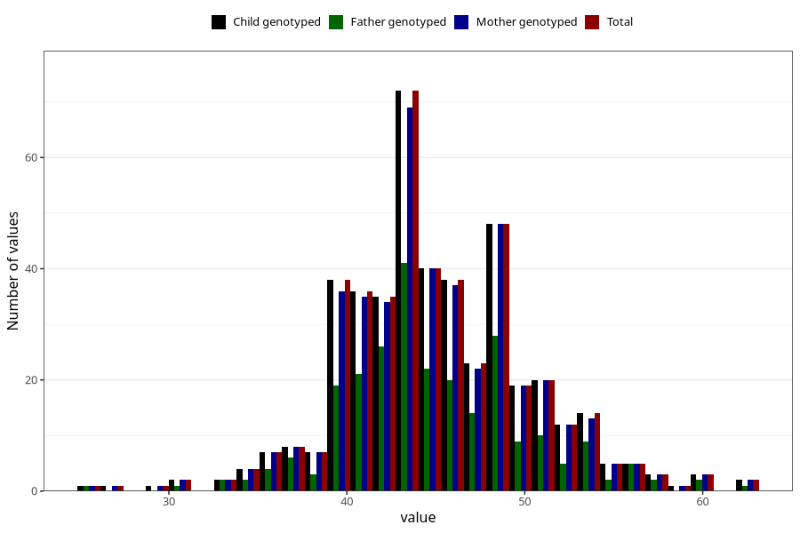

# muscle_mass_kg_wf
Variable mapping to `WK18` in `WF_Klinikkskjema_v12`.
- Number of values:

| Value | Total | Child genotyped | Mother genotyped | Father genotyped |
| ----- | ----- | --------------- | ---------------- | ---------------- |
| Missing | 74861 | 74861 | 71213 | 49829 |
| Non-missing | 447 | 447 | 437 | 255 |
| 25th percentile | 42 | 42 | 42 | 42 |
| 50th percentile | 45 | 45 | 45 | 45 |
| 75th percentile | 48 | 48 | 48 | 48 |
| Mean | 45.0380313199105 | 45.0380313199105 | 45.0640732265446 | 44.9803921568627 |
| Standard deviation | 5.2009729745909 | 5.2009729745909 | 5.22480980507547 | 5.19573642624045 |
| N | 447 | 447 | 437 | 255 |

