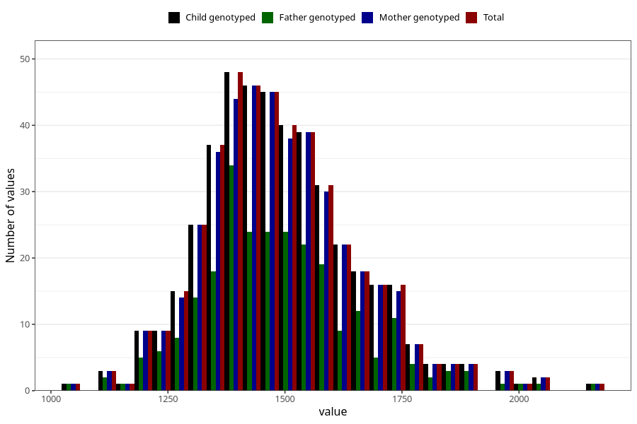

# resting_metab_wf
Variable mapping to `WK20` in `WF_Klinikkskjema_v12`.
- Number of values:

| Value | Total | Child genotyped | Mother genotyped | Father genotyped |
| ----- | ----- | --------------- | ---------------- | ---------------- |
| Missing | 74861 | 74861 | 71213 | 49829 |
| Non-missing | 447 | 447 | 437 | 255 |
| 25th percentile | 1382.5 | 1382.5 | 1381 | 1384 |
| 50th percentile | 1473 | 1473 | 1474 | 1470 |
| 75th percentile | 1578.5 | 1578.5 | 1579 | 1574.5 |
| Mean | 1492.04697986577 | 1492.04697986577 | 1492.95881006865 | 1490.87450980392 |
| Standard deviation | 164.295956934654 | 164.295956934654 | 165.04062092824 | 168.693613901991 |
| N | 447 | 447 | 437 | 255 |

