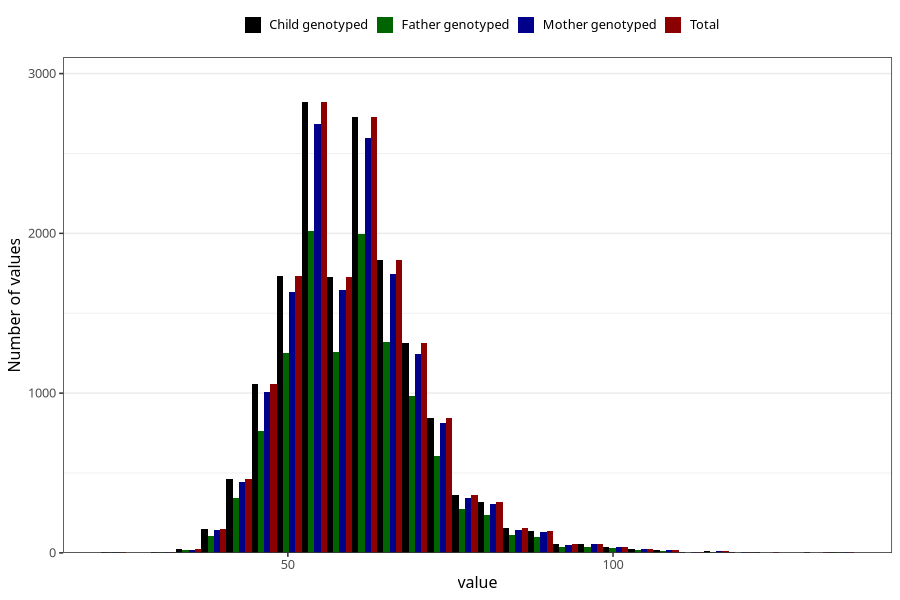

# weight_14c
Variable mapping to `UB221` in `Ungdomsskjema_Barn_v12_standard`.
- Number of values:

| Value | Total | Child genotyped | Mother genotyped | Father genotyped |
| ----- | ----- | --------------- | ---------------- | ---------------- |
| Missing | 59392 | 59392 | 56528 | 38551 |
| Non-missing | 15916 | 15916 | 15122 | 11533 |
| 25th percentile | 53 | 53 | 53 | 53 |
| 50th percentile | 59 | 59 | 59 | 60 |
| 75th percentile | 66 | 66 | 66 | 66 |
| Mean | 60.3552400100528 | 60.3552400100528 | 60.3456553365957 | 60.3464840024278 |
| Standard deviation | 10.8557024369456 | 10.8557024369456 | 10.8293307170796 | 10.770899027588 |
| N | 15916 | 15916 | 15122 | 11533 |

