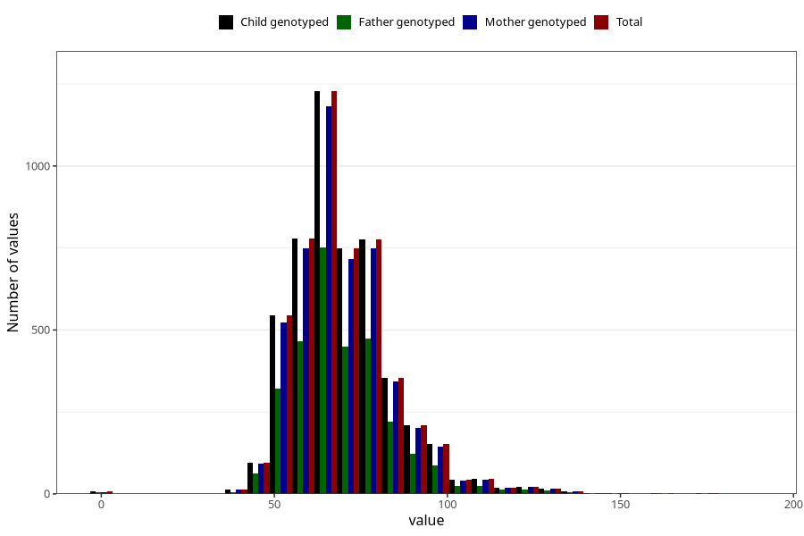

# weight_18
Variable mapping to `VE44` in `18-aarsskjema_v12_standard`.
- Number of values:

| Value | Total | Child genotyped | Mother genotyped | Father genotyped |
| ----- | ----- | --------------- | ---------------- | ---------------- |
| Missing | 70236 | 70236 | 66774 | 47026 |
| Non-missing | 5072 | 5072 | 4876 | 3058 |
| 25th percentile | 60 | 60 | 60 | 60 |
| 50th percentile | 68 | 68 | 68 | 68 |
| 75th percentile | 77 | 77 | 77 | 77 |
| Mean | 70.1102129337539 | 70.1102129337539 | 70.0976210008203 | 70.0258338783519 |
| Standard deviation | 14.9551976085162 | 14.9551976085162 | 14.8813532084136 | 14.7435271484952 |
| N | 5072 | 5072 | 4876 | 3058 |

