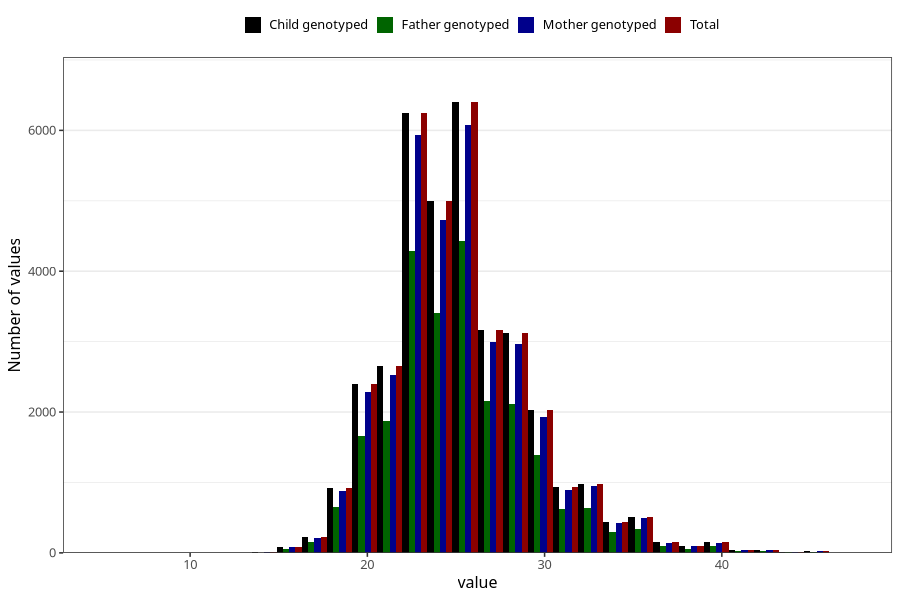

# weight_7y
Variable mapping to `JJ325` in `Skjema7aar_v12`.
- Number of values:

| Value | Total | Child genotyped | Mother genotyped | Father genotyped |
| ----- | ----- | --------------- | ---------------- | ---------------- |
| Missing | 39629 | 39629 | 37740 | 25680 |
| Non-missing | 35679 | 35679 | 33910 | 24404 |
| 25th percentile | 22.5 | 22.5 | 22.5 | 22.4 |
| 50th percentile | 25 | 25 | 25 | 25 |
| 75th percentile | 27.5 | 27.5 | 27.5 | 27.3 |
| Mean | 25.2280417052047 | 25.2280417052047 | 25.2307637864937 | 25.1669808228159 |
| Standard deviation | 4.07535739219894 | 4.07535739219894 | 4.08082612428821 | 4.03350814226756 |
| N | 35679 | 35679 | 33910 | 24404 |

