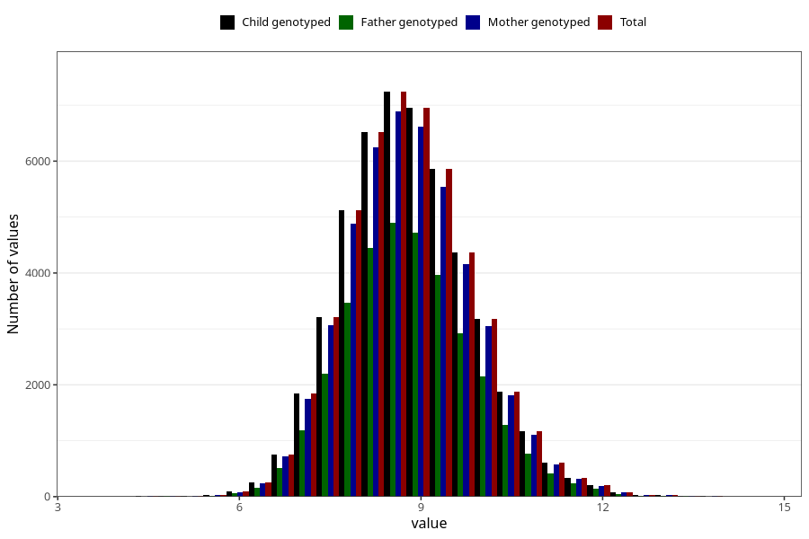

# weight_8m
Variable mapping to `EE386` in `Skjema5_18mnd_v12`.
- Number of values:

| Value | Total | Child genotyped | Mother genotyped | Father genotyped |
| ----- | ----- | --------------- | ---------------- | ---------------- |
| Missing | 25489 | 25489 | 24186 | 16421 |
| Non-missing | 49819 | 49819 | 47464 | 33663 |
| 25th percentile | 8.09 | 8.09 | 8.09 | 8.095 |
| 50th percentile | 8.75 | 8.75 | 8.75 | 8.755 |
| 75th percentile | 9.47 | 9.47 | 9.47 | 9.46 |
| Mean | 8.80979756719324 | 8.80979756719324 | 8.80999136187426 | 8.81250019309034 |
| Standard deviation | 1.05222927834318 | 1.05222927834318 | 1.05298746483966 | 1.0484355682938 |
| N | 49819 | 49819 | 47464 | 33663 |

