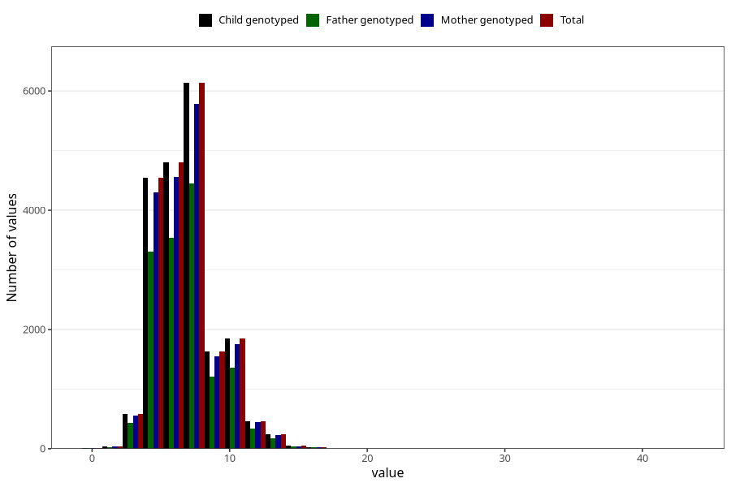

# age_first_tooth
Variable mapping to `EE1012` in `Skjema5_18mnd_v12`.
- Number of values:

| Value | Total | Child genotyped | Mother genotyped | Father genotyped |
| ----- | ----- | --------------- | ---------------- | ---------------- |
| Missing | 54908 | 54908 | 52350 | 35174 |
| Non-missing | 20400 | 20400 | 19300 | 14910 |
| 25th percentile | 5 | 5 | 5 | 5 |
| 50th percentile | 7 | 7 | 7 | 7 |
| 75th percentile | 8 | 8 | 8 | 8 |
| Mean | 6.93176470588235 | 6.93176470588235 | 6.92378238341969 | 6.93138832997988 |
| Standard deviation | 2.24173910370023 | 2.24173910370023 | 2.22731331464303 | 2.23026834075936 |
| N | 20400 | 20400 | 19300 | 14910 |

