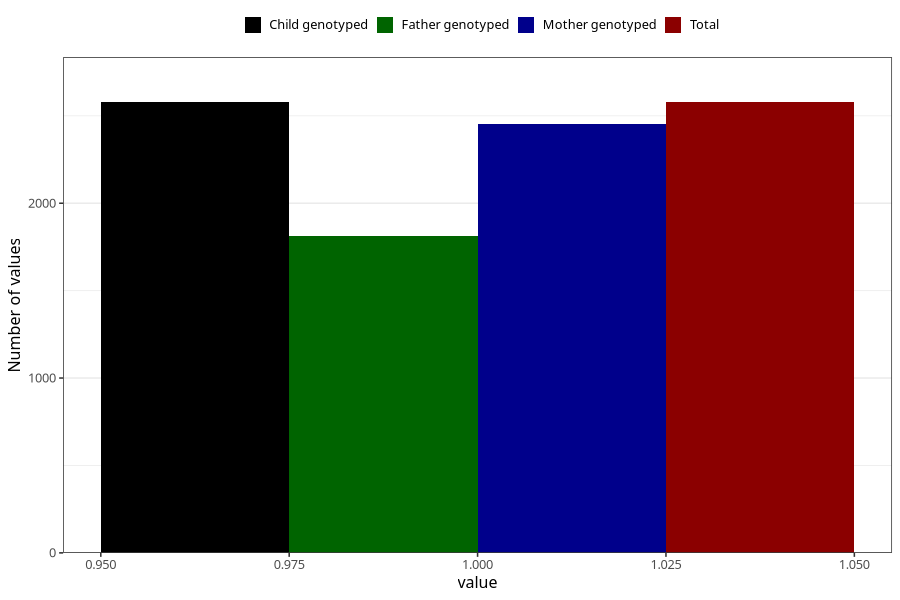

# asthma_yes_18m
Variable mapping to `EE824` in `Skjema5_18mnd_v12`.
- Number of values:

| Value | Total | Child genotyped | Mother genotyped | Father genotyped |
| ----- | ----- | --------------- | ---------------- | ---------------- |
| Missing | 72730 | 72730 | 69194 | 48269 |
| Non-missing | 2578 | 2578 | 2456 | 1815 |
| 1 | 2578 | 2578 | 2456 | 1815 |

