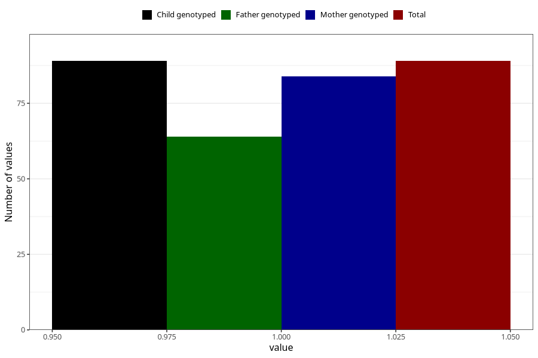

# autistic_traits_autism_Aspergers_syndrome_past_8y
Variable mapping to `NN54` in `Skjema8aar_v12`.
- Number of values:

| Value | Total | Child genotyped | Mother genotyped | Father genotyped |
| ----- | ----- | --------------- | ---------------- | ---------------- |
| Missing | 75219 | 75219 | 71566 | 50020 |
| Non-missing | 89 | 89 | 84 | 64 |
| 1 | 89 | 89 | 84 | 64 |

