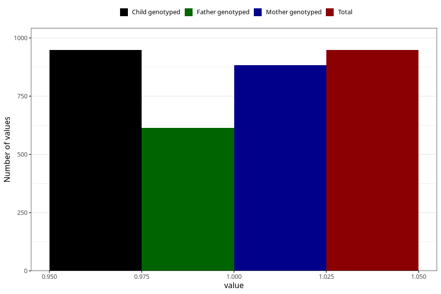

# behavioral_problems_difficult_and_unruly_currently_8y
Variable mapping to `NN57` in `Skjema8aar_v12`.
- Number of values:

| Value | Total | Child genotyped | Mother genotyped | Father genotyped |
| ----- | ----- | --------------- | ---------------- | ---------------- |
| Missing | 74360 | 74360 | 70767 | 49469 |
| Non-missing | 948 | 948 | 883 | 615 |
| 1 | 948 | 948 | 883 | 615 |

