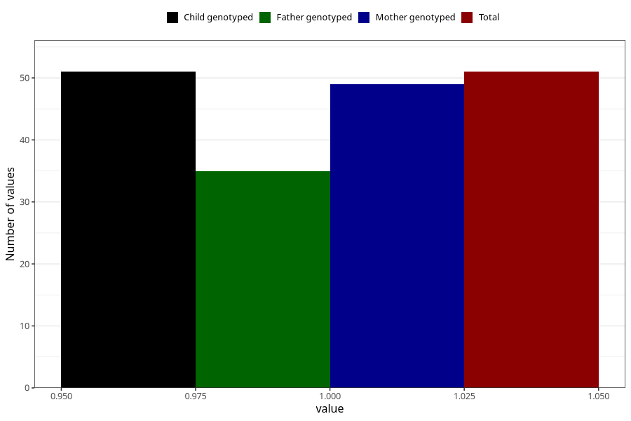

# cerebral_palsy_8y
Variable mapping to `NN33` in `Skjema8aar_v12`.
- Number of values:

| Value | Total | Child genotyped | Mother genotyped | Father genotyped |
| ----- | ----- | --------------- | ---------------- | ---------------- |
| Missing | 75257 | 75257 | 71601 | 50049 |
| Non-missing | 51 | 51 | 49 | 35 |
| 1 | 51 | 51 | 49 | 35 |

