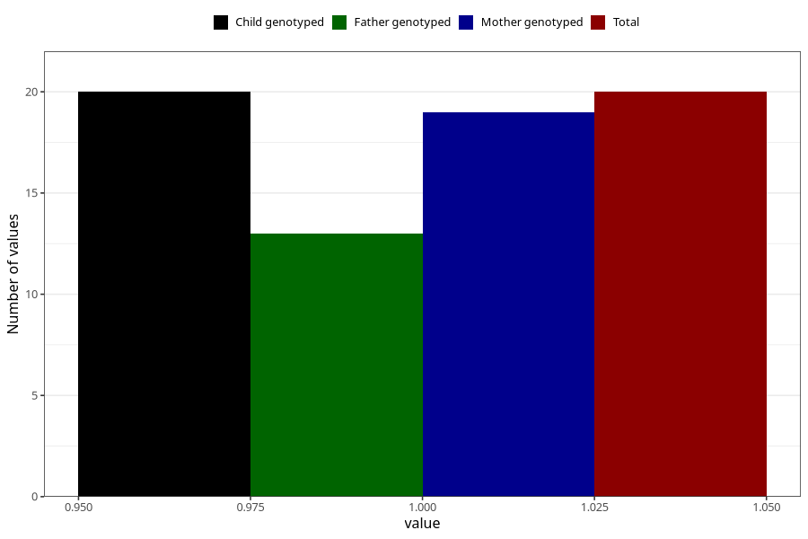

# chromosomal_defect_6m
Variable mapping to `DD1111` in `Skjema4_6mnd_v12`.
- Number of values:

| Value | Total | Child genotyped | Mother genotyped | Father genotyped |
| ----- | ----- | --------------- | ---------------- | ---------------- |
| Missing | 75288 | 75288 | 71631 | 50071 |
| Non-missing | 20 | 20 | 19 | 13 |
| 1 | 20 | 20 | 19 | 13 |

