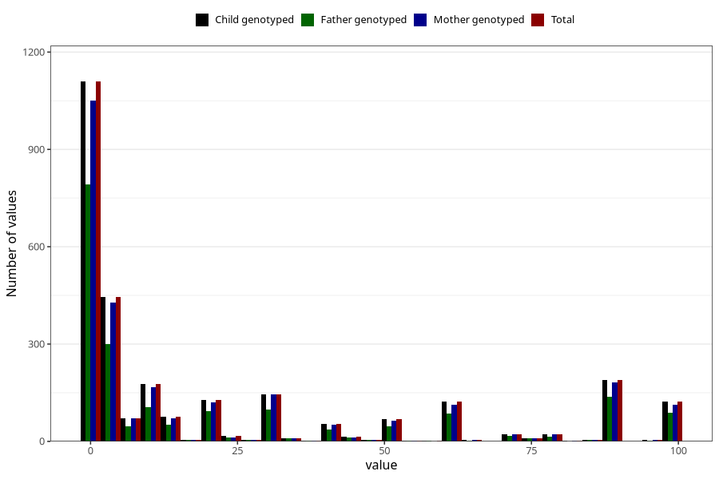

# colic_freq_6m
Variable mapping to `DD304` in `Skjema4_6mnd_v12`.
- Number of values:

| Value | Total | Child genotyped | Mother genotyped | Father genotyped |
| ----- | ----- | --------------- | ---------------- | ---------------- |
| Missing | 72469 | 72469 | 68958 | 48105 |
| Non-missing | 2839 | 2839 | 2692 | 1979 |
| 25th percentile | 1 | 1 | 1 | 1 |
| 50th percentile | 4 | 4 | 4 | 4 |
| 75th percentile | 30 | 30 | 30 | 30 |
| Mean | 21.9711165903487 | 21.9711165903487 | 21.8124071322437 | 22.277412834765 |
| Standard deviation | 31.3232573701458 | 31.3232573701458 | 31.2353615843369 | 31.6074467134253 |
| N | 2839 | 2839 | 2692 | 1979 |

