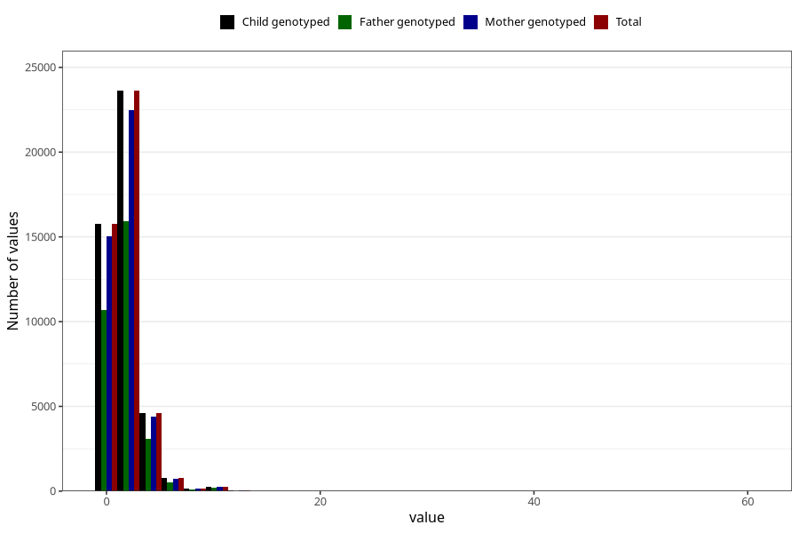

# common_cold_number_6_11m
Variable mapping to `EE216` in `Skjema5_18mnd_v12`.
- Number of values:

| Value | Total | Child genotyped | Mother genotyped | Father genotyped |
| ----- | ----- | --------------- | ---------------- | ---------------- |
| Missing | 30006 | 30006 | 28533 | 19524 |
| Non-missing | 45302 | 45302 | 43117 | 30560 |
| Filled in text or mark instead of number | 8 | 8 | 7 |6 |
| 25th percentile | 1 | 1 | 1 | 1 |
| 50th percentile | 2 | 2 | 2 | 2 |
| 75th percentile | 3 | 3 | 3 | 3 |
| Mean | 2.21448757009758 | 2.21448757009758 | 2.21275806077476 | 2.2119198795575 |
| Standard deviation | 1.5273198776937 | 1.5273198776937 | 1.53008130084016 | 1.55387246811509 |
| N | 45294 | 45294 | 43110 | 30554 |

