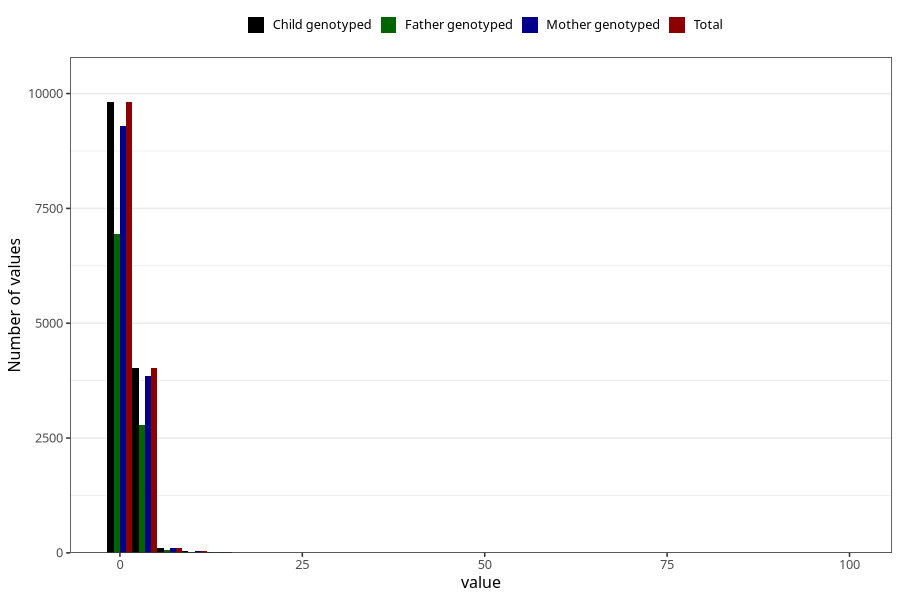

# conjunctivities_freq_6m
Variable mapping to `DD292` in `Skjema4_6mnd_v12`.
- Number of values:

| Value | Total | Child genotyped | Mother genotyped | Father genotyped |
| ----- | ----- | --------------- | ---------------- | ---------------- |
| Missing | 61261 | 61261 | 58317 | 40214 |
| Non-missing | 14047 | 14047 | 13333 | 9870 |
| 25th percentile | 1 | 1 | 1 | 1 |
| 50th percentile | 1 | 1 | 1 | 1 |
| 75th percentile | 2 | 2 | 2 | 2 |
| Mean | 1.59906029757244 | 1.59906029757244 | 1.6038400960024 | 1.58470111448835 |
| Standard deviation | 2.82807354416964 | 2.82807354416964 | 2.87943403606823 | 2.84561888709139 |
| N | 14047 | 14047 | 13333 | 9870 |

