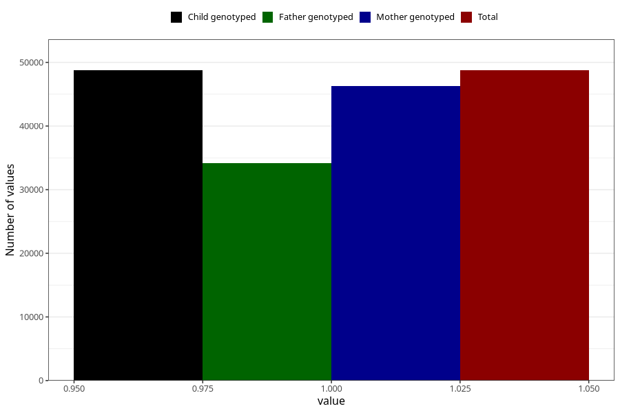

# delayed_motor_development_no_18m
Variable mapping to `EE799` in `Skjema5_18mnd_v12`.
- Number of values:

| Value | Total | Child genotyped | Mother genotyped | Father genotyped |
| ----- | ----- | --------------- | ---------------- | ---------------- |
| Missing | 26559 | 26559 | 25315 | 15934 |
| Non-missing | 48749 | 48749 | 46335 | 34150 |
| 1 | 48749 | 48749 | 46335 | 34150 |

