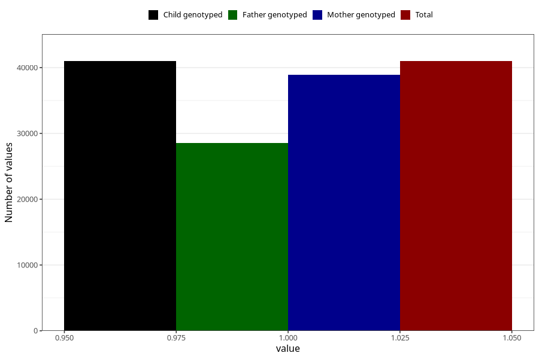

# delayed_motor_development_no_3y
Variable mapping to `GG37` in `Skjema6_3aar_v12`.
- Number of values:

| Value | Total | Child genotyped | Mother genotyped | Father genotyped |
| ----- | ----- | --------------- | ---------------- | ---------------- |
| Missing | 34325 | 34325 | 32703 | 21527 |
| Non-missing | 40983 | 40983 | 38947 | 28557 |
| 1 | 40983 | 40983 | 38947 | 28557 |

