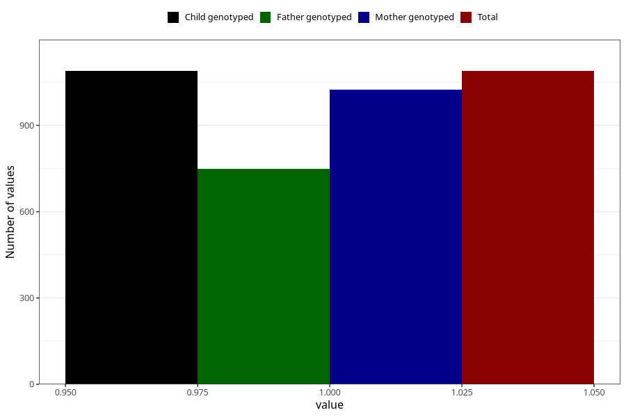

# delayed_motor_development_previously_18m
Variable mapping to `EE801` in `Skjema5_18mnd_v12`.
- Number of values:

| Value | Total | Child genotyped | Mother genotyped | Father genotyped |
| ----- | ----- | --------------- | ---------------- | ---------------- |
| Missing | 74219 | 74219 | 70626 | 49336 |
| Non-missing | 1089 | 1089 | 1024 | 748 |
| 1 | 1089 | 1089 | 1024 | 748 |

