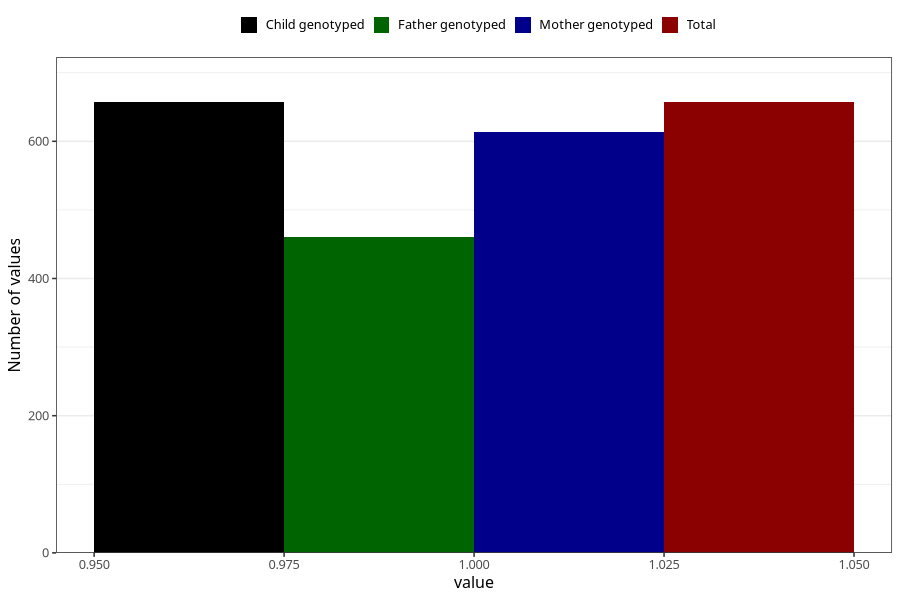

# delayed_motor_development_yes_18m
Variable mapping to `EE800` in `Skjema5_18mnd_v12`.
- Number of values:

| Value | Total | Child genotyped | Mother genotyped | Father genotyped |
| ----- | ----- | --------------- | ---------------- | ---------------- |
| Missing | 74651 | 74651 | 71036 | 49623 |
| Non-missing | 657 | 657 | 614 | 461 |
| 1 | 657 | 657 | 614 | 461 |

