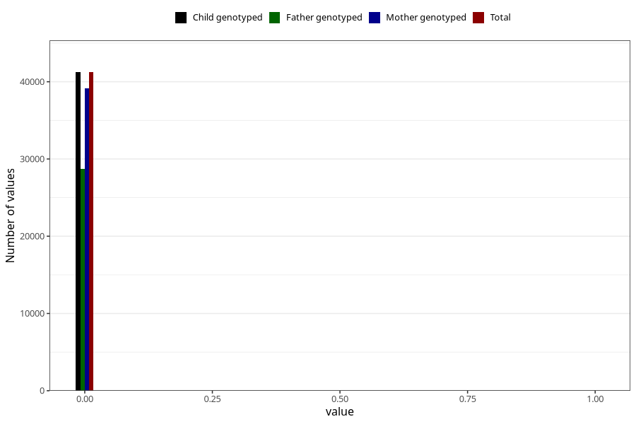

# diabetes_3y
Variable created during phenotype curation.
- Number of values:

| Value | Total | Child genotyped | Mother genotyped | Father genotyped |
| ----- | ----- | --------------- | ---------------- | ---------------- |
| Missing | 34050 | 34050 | 32447 | 21329 |
| Non-missing | 41258 | 41258 | 39203 | 28755 |
| 0 | 41232 | 41232 | 39178 | 28735 |
| 1 | 26 | 26 | 25 | 20 |

