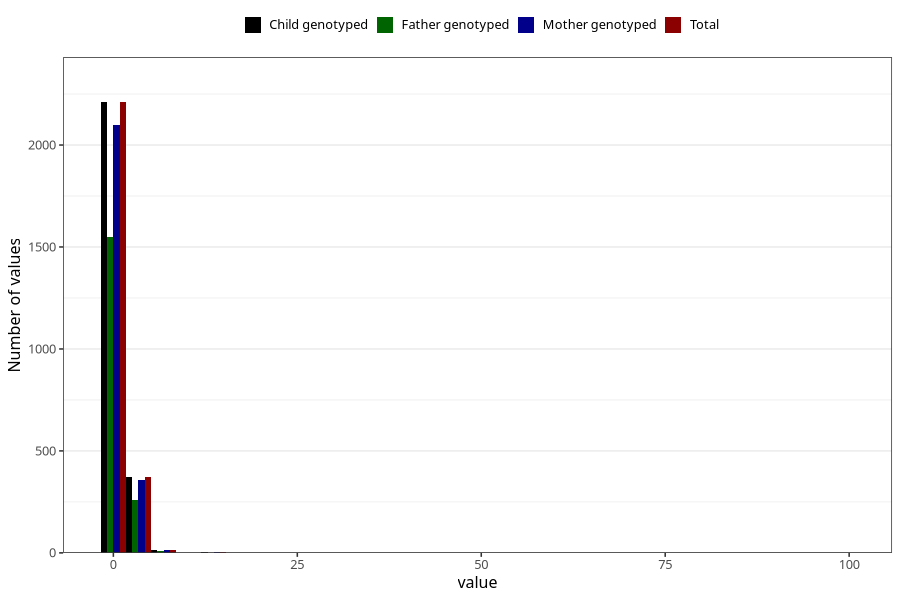

# ear_infection_freq_6m
Variable mapping to `DD272` in `Skjema4_6mnd_v12`.
- Number of values:

| Value | Total | Child genotyped | Mother genotyped | Father genotyped |
| ----- | ----- | --------------- | ---------------- | ---------------- |
| Missing | 72709 | 72709 | 69182 | 48263 |
| Non-missing | 2599 | 2599 | 2468 | 1821 |
| 0 | 89 | 89 | 83 | 68 |
| 1 | 2121 | 2121 | 2013 | 1483 |
| 2 | 279 | 279 | 268 | 191 |
| 3 | 67 | 67 | 64 | 49 |
| 4 | 17 | 17 | 14 | 9 |
| 5 | 9 | 9 | 9 | 9 |
| 6 | 5 | 5 | 5 | 5 |
| 7 | 8 | 8 | 8 | 5 |
| 10 | 1 | 1 | 1 | 1 |
| 12 | 1 | 1 | 1 | 0 |
| 15 | 1 | 1 | 1 | 0 |
| 99 | 1 | 1 | 1 | 1 |

